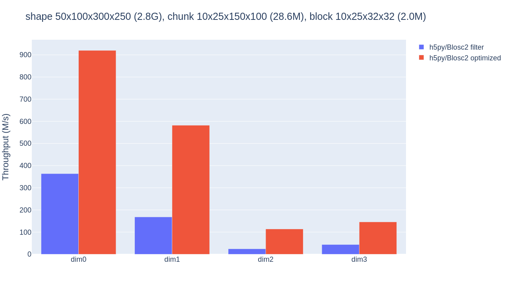

b2h5py
======

``b2h5py`` provides h5py_ with transparent, automatic optimized reading of n-dimensional slices of Blosc2_-compressed datasets. This optimized slicing leverages direct chunk access (skipping the slow HDF5 filter pipeline) and 2-level partitioning into chunks and then smaller blocks (so that less data is actually decompressed).

.. _h5py: https://www.h5py.org/
.. _Blosc2: https://www.blosc.org/

Benchmarks of this technique show 2x-5x speed-ups compared with normal filter-based access. Comparable results are obtained with a similar technique in PyTables, see `Optimized Hyper-slicing in PyTables with Blosc2 NDim`_.

.. _Optimized Hyper-slicing in PyTables with Blosc2 NDim: https://www.blosc.org/posts/pytables-b2nd-slicing/

Usage
-----

This optimized access works for slices with step 1 on Blosc2-compressed datasets using the native byte order. It is enabled by monkey-patching the ``h5py.Dataset`` class to extend the slicing operation. This is done on module import, so the only thing you need to do is::

    import b2h5py

After that, optimization will be attempted for any slicing of a dataset (of the form ``dataset[...]`` or ``dataset.__getitem__(...)``). If the optimization is not possible in a particular case, normal h5py slicing code will be used (which performs HDF5 filter-based access, backed by hdf5plugin_ to support Blosc2).

.. _hdf5plugin: https://github.com/silx-kit/hdf5plugin

Even if the module is imported and the ``Dataset`` class is patched, you may still force-disable the optimization by setting ``BLOSC2_FILTER=1`` in the environment.

Building
--------

Just install PyPA build (e.g. ``pip install build``), enter the source code directory and run ``pyproject-build`` to get a source tarball and a wheel under the ``dist`` directory.

Installing
----------

To install as a wheel from PyPI, run ``pip install b2h5py``.

You may also install the wheel that you built in the previous section, or enter the source code directory and run ``pip install .`` from there.

Running tests
-------------

If you have installed ``b2h5py``, just run ``python -m unittest discover b2h5py.tests``.

Otherwise, just enter its source code directory and run ``python -m unittest``.
